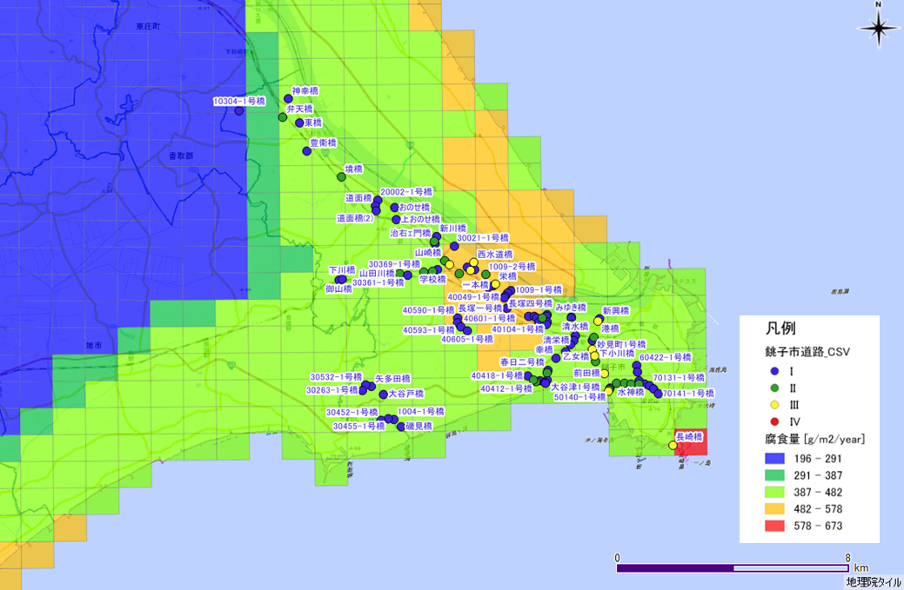

# python 演習３　～実習～

**目　標**：　本講座の目標

大気腐食データセットを使用して機械学習を学ぶ目的は、以下のようなものがあります。

1. **予測アルゴリズムの学習**: 大気腐食データセットは、６か所の月次の腐食量を測定したデータです。このデータセットを使用して、予測アルゴリズム（線形回帰、ランダムフォレストなど）を学び、腐食速度を予測することができます。

2. **特徴選択と次元削減の理解**: 大気腐食データセットには、気象因子を特徴量としています。これらの特徴量を分析し、適切な特徴量の選択や次元削減（主成分分析など）を行うことで、モデルのパフォーマンス向上につなげることができます。

3. **モデル評価とパフォーマンス指標の理解**: 大気腐食データセットを使用してトレーニングしたモデルを評価し、予測のパフォーマンスを評価することができます。R2などのパフォーマンス指標を理解し、モデルの性能を評価するスキルを習得することができます。

4. **データの可視化と解釈**: 大気腐食データセットは、データの可視化に適しています。特徴の分布や相関関係を可視化することで、データの特性やパターンを理解することができます。また、モデルの解釈や予測結果の説明に役立つ洞察を得ることもできます。

## 演習コード
Google Colabでステップ・バイ・ステップで動作を確認しながら進めます．下記のボタンを押して進んでください．

  

